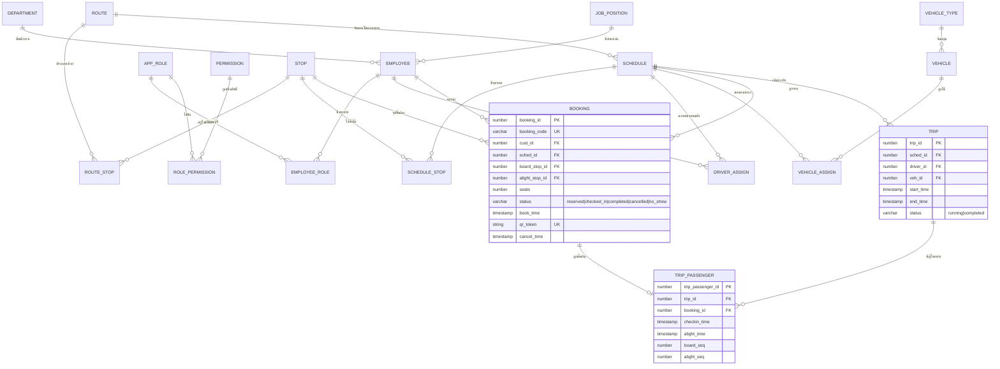

# บทที่ 17 : Full Stack Development

> ส่วนนี้อธิบาย "ระบบที่สร้างขึ้นจริง" ทั้งด้านสถาปัตยกรรม เทคโนโลยี โครงสร้างฐานข้อมูล
> REST API และแอปพลิเคชัน Flutter เพื่อให้ครอบคล้องกับข้อกำหนดในบทที่ 2–16

---

## 17.0 ขอบเขตและข้อตกลงของโครงการ (Scope & Assumptions)

> ⚠️ **อ่านหัวข้อนี้ก่อนทุกบท** เพราะเป็นตัวกำหนดว่า "อะไรอยู่ในขอบเขต และอะไรไม่อยู่"
> หากอาจารย์ถามว่า "ทำไมถึงไม่มีเว็บ" ให้ตอบตามตารางนี้

| # | การตัดสินใจ | สถานะ | เหตุผล |
|---|---|---|---|
| 1 | **การพัฒนาเว็บด้วย React** | ⛔ **นอกขอบเขต** | ไม่ทำ Web Application เลย ระบบทั้งหมดเป็น Mobile Application |
| 2 | **ฐานข้อมูล** | ✅ **Oracle Database 19c** (ทดสอบได้ทั้ง 21c / XE) | ตามที่ทีมกำหนด และมีความสามารถรองรับรายงานดีกว่า |
| 3 | **Client** | ✅ **Flutter (Android)** ทุกบทบาท | Admin / Staff / Driver / Customer ใช้แอปเดียวกัน |
| 4 | **Backend** | ✅ REST API (Node.js + Express) | เป็นตัวกลางให้ Flutter ทุกแพลตฟอร์มเข้าถึงฐานข้อมูลได้อย่างปลอดภัย |
| 5 | **จำนวนสมาชิก** | ✅ **2 คน** | นายเก่งกาญ เชี่ยวชาญ / นางสาวสุขสรร มาณีศรี |
| 6 | **วันทำงาน** | ✅ **จันทร์ – เสาร์** (6 วัน/สัปดาห์) | มี Daily Stand-up ทุกวันทำงาน ตามหลัก Agile |
| 7 | **Sprint** | ✅ **1 วัน** (Fixed Time-box) | 1 Sprint = 1 วันทำงาน |

### 17.0.1 ผลกระทบจากการตัด React ออก (ต้องเตรียมให้ดี)

เมื่อไม่มีเว็บ งานส่วน "จัดการข้อมูลจำนวนมาก" (ตารางพนักงาน, Permission Matrix, ตารางรอบรถ, รายงาน)
ต้องทำบน Flutter ซึ่งต้องออกแบบเป็น **Adaptive UI** ไม่ใช่ Mobile UI ล้วน

| ประเด็น | วิธีรับมือ |
|---|---|
| ตารางข้อมูลกว้าง (พนักงาน, รายงาน, Permission Matrix) | ใช้ `DataTable` / `PaginatedDataTable` + **โหมด Tablet (แนวนอน)** และทำ **Master–Detail** แทนการเปิด Modal ใหญ่ |
| ฟอร์มกรอกข้อมูลเยอะ (เพิ่มพนักงาน, เพิ่มจุดจอด) | ใช้ **Stepper Form** แยกเป็นหน้า แทนฟอร์มยาว 1 หน้า |
| กราฟรายงาน | ใช้ `fl_chart` (รองรับทั้งแนวตั้ง/แนวนอน) + ปุ่ม **Export เป็น PNG/PDF** เพื่อให้อาจารย์นำไปใส่รายงานได้ |
| เข้าใช้งานบนหน้าจอเล็ก | ใช้ `LayoutBuilder` สลับ `NavigationBar` (มือถือ) ↔ `NavigationRail` (แท็บเล็ต) อัตโนมัติ |
| คนขับต้องสแกน QR | ใช้กล้องมือถือ — **ยืนยันว่าจำเป็นต้องเป็น Mobile** จึงเลือก Flutter เป็นเทคโนโลยีเดียว |

> ✅ **จุดแข็งที่ตอบคำถามได้ดี:** ระบบเดียว (Single App) ใช้ทุกบทบาท
> → ลดโค้ดซ้ำซ้อน, ใช้ REST API ตัวเดียวกัน, ข้อมูลไม่ซ้ำซ้อน (Single Source of Truth)
> → และ "คนขับต้องสแกน QR Code ริมทาง" คือข้อบังคับทางเทคนิคว่า **ต้องมี Mobile App**

---

## 17.1 ภาพรวมระบบ (System Overview)

ระบบ SHUTTLE BUS SYSTEM ประกอบด้วย 3 ชั้น (3-Tier Architecture)

```
┌──────────────────────────────────────────────────────────────┐
│                    Mobile Application                        │
│                  Flutter 3.x  (Android)                      │
│                                                              │
│  ┌──────────┬──────────┬──────────┬──────────┐               │
│  │  Admin   │  Staff   │  Driver  │ Customer │  ← Role เดียวกัน│
│  └──────────┴──────────┴──────────┴──────────┘               │
│  เมนูถูกสร้าง Dynamic ตาม permission ที่ Login ได้รับ         │
│  Port : แอป Android  (ไม่มี Web Application)                 │
└───────────────────────────┬──────────────────────────────────┘
                            │  HTTPS / JSON (REST)
                            │  Authorization: Bearer <JWT>
                            ▼
        ┌────────────────────────────────────────────┐
        │   REST API Backend  (Node.js + Express)   │
        │   Port : 3000                              │
        │  ┌──────────────────────────────────────┐  │
        │  │ Middleware : JWT Auth / RBAC / Log   │  │
        │  │ Controller → Service → Repository    │  │
        │  │ QR Generator (qrcode)                │  │
        │  └──────────────────────────────────────┘  │
        └────────────────────┬───────────────────────┘
                             │  node-oracledb (Thin Mode)
                             │  Connection Pool
                             ▼
        ┌────────────────────────────────────────────┐
        │   Relational Database  (Oracle 19c · XE 19c)   │
        │   4 กลุ่มตาราง : Master / Front /          │
        │   Booking / Trip                           │
        └────────────────────────────────────────────┘
```

### 17.1.1 การกระจายหน้าจอให้ผู้ใช้แต่ละกลุ่ม (ทุกบทบาทใช้แอปเดียวกัน)

| ผู้ใช้ | บทบาท (Role) | หน้าจอที่ใช้ | อุปกรณ์ |
|---|---|---|---|
| ผู้ดูแลระบบ | Admin | พนักงาน, แผนก/ตำแหน่ง, Role, Permission, Permission Matrix | แท็บเล็ต (แนวนอน) |
| พนักงานสำนักงาน | Staff | จุดจอด, เส้นทาง, รอบเวลา, มอบหมายคนขับ/รถ, รายงาน | แท็บเล็ต / มือถือ |
| คนขับรถ | Driver | ตารางงานรายวัน, เริ่มเดินทาง, Manifest, **สแกน QR**, ปิดงาน + สรุป | มือถือ (ต้องใช้กล้อง) |
| นักศึกษา / เจ้าหน้าที่ (ผู้โดยสาร) | Customer | จองรถ, QR Code, รายการเดินทาง, ยกเลิก | มือถือ |

> **เหตุผลเชิงเหตุผล (Justification) — สำหรับตอบคำถามอาจารย์**
> 1. **ข้อบังคับทางเทคนิค:** คนขับต้องสแกน QR Code ของผู้โดยสารที่จุดจอด → ต้องใช้ **กล้องมือถือ**
> 2. **หลีกเลี่ยงโค้ดซ้ำซ้อน:** แอปเดียวรองรับทั้ง 4 บทบาท เมนูแสดงตามสิทธิ์ที่ Login ได้รับ
> 3. **ความปลอดภัย:** การเข้าถึงฐานข้อมูล Oracle ทำผ่าน REST API เท่านั้น — ไม่มี Credential อยู่บนเครื่องผู้ใช้
> 4. **ทีม 2 คน:** เลือกเทคโนโลยีเดียวให้ทั้งโปรเจกต์ ลดเวลาเรียนรู้และลดจำนวนเทคโนโลยีที่ต้องอธิบายในรายงาน

---

## 17.2 การเลือกเทคโนโลยี (Technology Selection)

| ชั้น | เทคโนโลยี | เหตุผล |
|---|---|---|
| **Mobile Framework** | Flutter 3.x (Dart) | เขียนครั้งเดียวได้ทั้ง Android/iOS · UI สม่ำเสมอทุกอุปกรณ์ · **รองรับ Adaptive UI** (มือถือ/แท็บเล็ต) · เหมาะกับการสแกน QR |
| **State Management** | Provider (หรือ Riverpod) | เก็บสถานะผู้ใช้ + JWT + Permission Flag + ข้อมูล Trip ที่กำลังใช้งาน |
| **HTTP Client** | `dio` | รองรับ Interceptor (แนบ Bearer Token, จัดการ 401/403) และ Timeout |
| **QR Scanning** | `mobile_scanner` | สแกน QR แบบเรียลไทม์ด้วยกล้อง (สำหรับ D3) |
| **QR Generation** | `qr_flutter` (บน Flutter) + `qrcode` (บน Backend สำรอง) | ฝั่งผู้ใช้สร้างจาก `qr_token` · ฝั่ง Server คืน Data URL เผื่อส่งออกเป็น PDF |
| **Local Storage** | `flutter_secure_storage` | เก็บ JWT อย่างปลอดภัย (เข้ารหัสด้วย Android Keystore) ไม่เก็บแบบ plaintext |
| **Chart** | `fl_chart` | กราฟ Bar / Line / Pie / Stacked ตามที่รายงาน 1–7 ต้องการ ทำงานได้ทั้งมือถือ/แท็บเล็ต |
| **Table (Admin)** | `DataTable` / `PaginatedDataTable` (Flutter built-in) | ไม่ต้องพึ่ง plugin ภายนอก ลดความเสี่ยง dependency |
| **Backend Runtime** | Node.js 20 LTS + Express 4 | RESTful เป็นมาตรฐาน · ไลบรารี Oracle (`node-oracledb`) สมัยใหม่ · ทำงานเร็ว เขียนสั้น |
| **Database Driver** | `node-oracledb` (Thin Mode) | **ไม่ต้องติดตั้ง Oracle Client** → ติดตั้งง่ายบนเครื่องนักศึกา · รองรับ Connection Pool, Transaction, `FOR UPDATE` |
| **Database** | **Oracle Database 19c** (Oracle XE 19c สำหรับ DEV) | ตามที่กำหนด · รองรับ Transaction + Locking เข้มงวด (กันจองที่นั่งชน) · มี **Analytic Functions, LISTAGG, PIVOT, Materialized View, PL/SQL** ช่วยรายงาน |
| **Auth** | JWT (`jsonwebtoken`) + `bcryptjs` | Stateless token · hash รหัสผ่าน |
| **QR Payload** | Token สุ่มเก็บใน `booking.qr_token` | ตรวจสอบง่าย เปลี่ยนได้ เดาไม่ได้ |
| **Version Control** | Git + GitHub | เก็บประวัติแผนงาน Agile (10 คะแนน) |
| **Project Tracking** | ClickUp | จัดการ Backlog / Sprint / Task (10 คะแนน) |
| **DB Admin Tool** | Oracle SQL Developer / DBeaver | จัดการฐานข้อมูล · เตรียม Seed Data |
| **Report / Aggregate** | Oracle `VIEW` + `GROUP BY` + `Analytic Functions` | ลดความซับซ้อนในชั้น Service และทำรายงานเร็ว |

### 17.2.1 เหตุผลที่เลือก Oracle (ตอบคำถาม "ทำไมถึงเลือก Oracle")

| เหตุผล | รายละเอียดที่เกี่ยวกับระบบนี้ |
|---|---|
| 1. ตรงกับข้อกำหนด | โจทย์ระบุให้ใช้ฐานข้อมูล SQL และทีมกำหนดเป็น Oracle |
| 2. Transaction & Locking เข้มงวด | ใช้ `SELECT ... FOR UPDATE NOWAIT` กันผู้ใช้ 2 คนจองที่นั่งสุดท้ายพร้อมกัน (BR-07) ได้อย่างปลอดภัย |
| 3. Analytic Functions | รายงาน R1 (รายสัปดาห์), R3 (พฤติกรรมราย user), R4 (รายวัน × เส้นทาง) เขียนด้วย `SUM() OVER (PARTITION BY ...)` ได้สั้นและชัด |
| 4. `LISTAGG` | รายงาน R5/D2 ต้องแสดง **รายชื่อผู้โดยสารต่อจุดจอด** → `LISTAGG(name, ', ')` รวมชื่อเป็นบรรทัดเดียว *(R5 เป็นตัวอย่างสำรอง ไม่ได้เลือกทำ แต่ D2 manifest ยังใช้)* |
| 5. `PIVOT` | รายงาน **R4** (จันทร์–อาทิตย์ × เส้นทาง 1–3) ใช้ `PIVOT` สร้างตารางตามตัวอย่างในเอกสารได้ตรงรูป |
| 6. `ROLLUP` | รายงาน **R6** ต้องมีแถว "รวมทั้งหมด" ตามตัวอย่าง → `GROUP BY ROLLUP(ชื่อคนขับ)` |
| 7. PL/SQL + `FORALL` | ใส่ข้อมูลรายงานจำนวนมาก (≥ 50,000 แถว) ด้วย `FORALL` ในไฟล์เดียว เสร็จในไม่กี่วินาที |
| 8. Sequence / Identity | รหัสอัตโนมัติแบบ `GENERATED ... AS IDENTITY` และ `CREATE SEQUENCE` สำหรับเลขที่เอกสาร (Booking Code) |
| 9. View / Materialized View | สร้าง `VIEW` สำเร็จรูปสำหรับรายงาน ทำให้ Service เรียกใช้งานง่ายและรันเร็วขึ้น |

---

## 17.3 โครงสร้างโปรเจกต์ (Project Structure)

```
shuttle-bus-system/
├── docs/                        # เอกสารประกอบโครงการ
│   ├── requirements/             # Requirement Specification
│   ├── diagrams/                 # ER, DFD, Use Case, Sequence, State
│   ├── agile/                    # แผนงาน, standup, retro
│   ├── ai-prompts/               # Prompt ที่ใช้กับ AI Agent
│   └── report/                   # บทรายงาน 1-18
├── database/
│   ├── 01_schema.sql             # DDL (Oracle) — Identity, FK, Index, COMMENT
│   ├── 02_seed_master.sql        # ข้อมูล Master ตั้งต้น (PL/SQL)
│   ├── 03_seed_front.sql         # เส้นทาง/รอบ/รถ/คนขับ ตามตัวอย่าง
│   ├── 04_seed_report_bulk.sql   # ข้อมูลจำนวนมากสำหรับรายงาน (ปี พ.ศ. 2568)
│   ├── 05_views_report.sql       # VIEW สำหรับรายงาน
│   └── 06_dummy_data.sql         # ข้อมูลตัวอย่างสำหรับทดสอบ (เผื่ออาจารย์ขอเพิ่ม)
├── backend/                      # Node.js + Express + node-oracledb
│   ├── src/
│   │   ├── config/               # env, db pool (node-oracledb)
│   │   ├── middleware/           # auth, rbac, validate, errorHandler, audit
│   │   ├── modules/
│   │   │   ├── auth/
│   │   │   ├── master/           # employee, app_role, permission, department
│   │   │   ├── front/            # stop, route, schedule, vehicle
│   │   │   ├── booking/
│   │   │   ├── driver/
│   │   │   └── report/
│   │   ├── services/
│   │   ├── repositories/
│   │   ├── utils/                # qrcode, time-calculator, validator
│   │   └── app.js / server.js
│   ├── tests/
│   └── package.json
├── app/                          # Flutter (Android) — ทุกบทบาทใช้ตัวนี้
│   ├── lib/
│   │   ├── core/                 # api client (dio), secure storage, theme
│   │   ├── layout/               # adaptive shell (NavigationBar / NavigationRail)
│   │   ├── features/
│   │   │   ├── auth/
│   │   │   ├── master/           # employee, role, permission
│   │   │   ├── front/            # stop, route, schedule
│   │   │   ├── booking/
│   │   │   ├── driver/
│   │   │   └── report/
│   │   └── main.dart
│   ├── test/
│   └── pubspec.yaml
└── README.md
```

> **หมายเหตุ:** ไม่มีโฟลเดอร์ `frontend-web/` เพราะการพัฒนาเว็บด้วย React อยู่นอกขอบเขต (17.0)

---

## 17.4 การออกแบบฐานข้อมูล (Database Design — Oracle)

### 17.4.1 กลุ่มตาราง

| Group | ตาราง |
|---|---|
| **Master — บุคคล / สิทธิ์** | `department`, `job_position`, `employee`, `app_role`, `permission`, `role_permission`, `employee_role`, `token_blacklist` |
| **Front — เส้นทาง / รอบ / ยานพาหนะ** | `stop`, `route`, `route_stop`, `vehicle_type`, `vehicle`, `schedule`, `schedule_stop`, `driver_assign`, `vehicle_assign` |
| **Booking — การจอง** | `booking` |
| **Trip — การเดินรถจริง / สถิติ** | `trip`, `trip_passenger` |

> ⚠️ **ชื่อตารางที่เปลี่ยนเพื่อหลีกเลี่ยงคำสงวนของ Oracle**
> | ชื่อเดิม (MySQL) | ชื่อใหม่ (Oracle) | เหตุผล |
> |---|---|---|
> | `role` | **`app_role`** | `ROLE` เป็นคำสงวน (ใช้กับ `CREATE ROLE`) |
> | `position` | **`job_position`** | `POSITION` เป็นคำสงวน |
> | `user` | **`employee`** | `USER` เป็นคำสงวน/ฟังก์ชันของ Oracle |

### 17.4.2 ER Diagram



### 17.4.3 DDL (Oracle)

> **หลักการออกแบบที่เปลี่ยนจาก MySQL**
> 1. ไม่มี `TIME` type ใน Oracle → เก็บเวลาเป็น **`TIMESTAMP` เต็ม (วัน+เวลา)** เพื่อให้บวกนาทีได้ตรง
> 2. ไม่มี `AUTO_INCREMENT` → ใช้ **`GENERATED ALWAYS AS IDENTITY`**
> 3. ไม่มี `ENUM` → ใช้ **`VARCHAR2` + `CHECK CONSTRAINT`**
> 4. ไม่มี `DATETIME` → ใช้ **`TIMESTAMP`** · ค่าเริ่มต้น `SYSTIMESTAMP`
> 5. ไม่มี `UNIQUE KEY` แบบ inline → ใช้ **`ALTER TABLE ... ADD CONSTRAINT`**
> 6. ต้องใส่ `COMMENT ON TABLE/COLUMN` เพื่อให้ Data Dictionary อธิบายได้ครบ

```sql
-- ==================================================================
--  01_schema.sql  —  ORACLE DATABASE 19c (XE 19c สำหรับนักศึกา)
--  ระบบรับส่งรถรับส่ง (Shuttle Bus System) สำนักงานเขตหนองจอก
-- ==================================================================

-- ------------------------------------------------------------------
-- กลุ่ม MASTER : บุคคลและสิทธิ์
-- ------------------------------------------------------------------
CREATE TABLE department (
  dept_id    NUMBER(10)     GENERATED ALWAYS AS IDENTITY (START WITH 1 INCREMENT BY 1),
  dept_name  VARCHAR2(120 CHAR) NOT NULL,
  created_at TIMESTAMP      DEFAULT SYSTIMESTAMP NOT NULL,
  CONSTRAINT pk_department            PRIMARY KEY (dept_id),
  CONSTRAINT uq_department_name      UNIQUE (dept_name)
);

CREATE TABLE job_position (
  position_id NUMBER(10)     GENERATED ALWAYS AS IDENTITY (START WITH 1 INCREMENT BY 1),
  position_name VARCHAR2(120 CHAR) NOT NULL,
  CONSTRAINT pk_job_position   PRIMARY KEY (position_id),
  CONSTRAINT uq_position_name  UNIQUE (position_name)
);

CREATE TABLE employee (
  emp_id        NUMBER(10)     GENERATED ALWAYS AS IDENTITY (START WITH 1 INCREMENT BY 1),
  emp_code      VARCHAR2(20 CHAR)  NOT NULL,
  first_name    VARCHAR2(80 CHAR)  NOT NULL,
  last_name     VARCHAR2(80 CHAR)  NOT NULL,
  phone         VARCHAR2(20 CHAR),
  email         VARCHAR2(120 CHAR),
  dept_id       NUMBER(10),
  position_id   NUMBER(10),
  username      VARCHAR2(50 CHAR)  NOT NULL,
  password_hash VARCHAR2(200 CHAR) NOT NULL,   -- bcrypt
  is_active     NUMBER(1)      DEFAULT 1 NOT NULL,
  created_at    TIMESTAMP      DEFAULT SYSTIMESTAMP NOT NULL,
  CONSTRAINT pk_employee        PRIMARY KEY (emp_id),
  CONSTRAINT uq_employee_code   UNIQUE (emp_code),
  CONSTRAINT uq_employee_user   UNIQUE (username),
  CONSTRAINT ck_employee_active CHECK (is_active IN (0,1)),
  CONSTRAINT fk_employee_dept     FOREIGN KEY (dept_id)     REFERENCES department(dept_id),
  CONSTRAINT fk_employee_position FOREIGN KEY (position_id) REFERENCES job_position(position_id)
);

CREATE TABLE app_role (            -- 'role' เป็นคำสงวนของ Oracle
  role_id     NUMBER(10)     GENERATED ALWAYS AS IDENTITY (START WITH 1 INCREMENT BY 1),
  role_name   VARCHAR2(50 CHAR)  NOT NULL,
  description VARCHAR2(255 CHAR),
  is_active   NUMBER(1)      DEFAULT 1 NOT NULL,
  CONSTRAINT pk_app_role  PRIMARY KEY (role_id),
  CONSTRAINT uq_app_role   UNIQUE (role_name),
  CONSTRAINT ck_app_role_active CHECK (is_active IN (0,1))
);

CREATE TABLE permission (
  perm_id    NUMBER(10)     GENERATED ALWAYS AS IDENTITY (START WITH 1 INCREMENT BY 1),
  perm_code  VARCHAR2(80 CHAR)  NOT NULL,   -- เช่น 'ROUTE.EDIT'
  perm_name  VARCHAR2(120 CHAR) NOT NULL,
  module     VARCHAR2(50 CHAR)  NOT NULL,   -- master | front | booking | driver | report
  screen_key VARCHAR2(80 CHAR),              -- รหัสหน้าจอ ใช้สร้าง Dynamic Menu
  sort_no    NUMBER(5)       DEFAULT 0 NOT NULL,
  CONSTRAINT pk_permission  PRIMARY KEY (perm_id),
  CONSTRAINT uq_perm_code   UNIQUE (perm_code)
);

CREATE TABLE role_permission (
  role_id NUMBER(10) NOT NULL,
  perm_id NUMBER(10) NOT NULL,
  CONSTRAINT pk_role_perm    PRIMARY KEY (role_id, perm_id),
  CONSTRAINT fk_rp_role      FOREIGN KEY (role_id) REFERENCES app_role(role_id)    ON DELETE CASCADE,
  CONSTRAINT fk_rp_perm      FOREIGN KEY (perm_id) REFERENCES permission(perm_id)  ON DELETE CASCADE
);

CREATE TABLE employee_role (
  emp_id  NUMBER(10) NOT NULL,
  role_id NUMBER(10) NOT NULL,
  CONSTRAINT pk_emp_role   PRIMARY KEY (emp_id, role_id),
  CONSTRAINT fk_er_emp     FOREIGN KEY (emp_id)  REFERENCES employee(emp_id) ON DELETE CASCADE,
  CONSTRAINT fk_er_role    FOREIGN KEY (role_id) REFERENCES app_role(role_id) ON DELETE CASCADE
);

CREATE TABLE token_blacklist (
  jti         VARCHAR2(64 CHAR) PRIMARY KEY,
  emp_id      NUMBER(10)  NOT NULL,
  expires_at  TIMESTAMP   NOT NULL,
  revoked_at  TIMESTAMP   DEFAULT SYSTIMESTAMP NOT NULL,
  CONSTRAINT fk_tb_emp FOREIGN KEY (emp_id) REFERENCES employee(emp_id) ON DELETE CASCADE
);

-- ------------------------------------------------------------------
-- กลุ่ม FRONT : เส้นทาง / รอบเวลา / ยานพาหนะ
-- ------------------------------------------------------------------
CREATE TABLE stop (
  stop_id    NUMBER(10)     GENERATED ALWAYS AS IDENTITY (START WITH 1 INCREMENT BY 1),
  stop_name  VARCHAR2(150 CHAR) NOT NULL,   -- เช่น 'มหาวิทยาลัยเทคโนโลยีมหานคร'
  address    VARCHAR2(255 CHAR),
  latitude   NUMBER(10,7),
  longitude  NUMBER(10,7),
  is_active  NUMBER(1)      DEFAULT 1 NOT NULL,
  CONSTRAINT pk_stop        PRIMARY KEY (stop_id),
  CONSTRAINT uq_stop_name   UNIQUE (stop_name),
  CONSTRAINT ck_stop_active CHECK (is_active IN (0,1))
);

CREATE TABLE route (
  route_id      NUMBER(10)     GENERATED ALWAYS AS IDENTITY (START WITH 1 INCREMENT BY 1),
  route_name    VARCHAR2(120 CHAR) NOT NULL,
  total_minutes NUMBER(5)      DEFAULT 0 NOT NULL,   -- คำนวณอัตโนมัติจาก route_stop
  description   VARCHAR2(255 CHAR),
  is_active     NUMBER(1)      DEFAULT 1 NOT NULL,
  CONSTRAINT pk_route      PRIMARY KEY (route_id),
  CONSTRAINT ck_route_min  CHECK (total_minutes >= 0),
  CONSTRAINT ck_route_act  CHECK (is_active IN (0,1))
);

CREATE TABLE route_stop (
  route_id       NUMBER(10) NOT NULL,
  stop_id        NUMBER(10) NOT NULL,
  stop_seq       NUMBER(5)  NOT NULL,    -- ลำดับจุดจอด 1..n
  travel_minutes NUMBER(5)  NOT NULL,    -- นาทีจากจุดก่อนหน้าถึงจุดนี้
  CONSTRAINT pk_route_stop    PRIMARY KEY (route_id, stop_seq),
  CONSTRAINT uq_route_stop_uk UNIQUE (route_id, stop_id),  -- BR-03 จุดจอดซ้ำในเส้นทางเดียวกันไม่ได้
  CONSTRAINT fk_rs_route FOREIGN KEY (route_id) REFERENCES route(route_id) ON DELETE CASCADE,
  CONSTRAINT fk_rs_stop  FOREIGN KEY (stop_id)  REFERENCES stop(stop_id),
  CONSTRAINT ck_rs_min   CHECK (travel_minutes >= 0)
);

CREATE TABLE vehicle_type (
  vtype_id   NUMBER(10)     GENERATED ALWAYS AS IDENTITY (START WITH 1 INCREMENT BY 1),
  vtype_name VARCHAR2(80 CHAR) NOT NULL,   -- 'รถตู้ 9 ที่นั่ง'
  capacity   NUMBER(5)      NOT NULL,      -- จำนวนที่นั่ง
  CONSTRAINT pk_vtype  PRIMARY KEY (vtype_id),
  CONSTRAINT uq_vtype  UNIQUE (vtype_name),
  CONSTRAINT ck_vtype_cap CHECK (capacity > 0)
);

CREATE TABLE vehicle (
  veh_id    NUMBER(10)     GENERATED ALWAYS AS IDENTITY (START WITH 1 INCREMENT BY 1),
  plate_no  VARCHAR2(20 CHAR) NOT NULL,    -- ทะเบียน เช่น 'สย 2591'
  vtype_id  NUMBER(10)     NOT NULL,
  is_active NUMBER(1)      DEFAULT 1 NOT NULL,
  CONSTRAINT pk_vehicle  PRIMARY KEY (veh_id),
  CONSTRAINT uq_vehicle_plate UNIQUE (plate_no),
  CONSTRAINT fk_vehicle_type  FOREIGN KEY (vtype_id) REFERENCES vehicle_type(vtype_id),
  CONSTRAINT ck_vehicle_act   CHECK (is_active IN (0,1))
);

-- schedule : เก็บทั้ง service_date และ depart_at (TIMESTAMP เต็ม) เพื่อคำนวณเวลาได้ตรง
CREATE TABLE schedule (
  sched_id     NUMBER(10)     GENERATED ALWAYS AS IDENTITY (START WITH 1 INCREMENT BY 1),
  route_id     NUMBER(10)     NOT NULL,
  service_date DATE           NOT NULL,   -- วันที่ให้บริการ
  depart_at    TIMESTAMP      NOT NULL,   -- วัน+เวลาออกจากจุดเริ่มต้น (เช่น 2568-01-01 09:30)
  is_active    NUMBER(1)      DEFAULT 1 NOT NULL,
  CONSTRAINT pk_schedule      PRIMARY KEY (sched_id),
  CONSTRAINT uq_route_depart  UNIQUE (route_id, depart_at),
  CONSTRAINT fk_schedule_route FOREIGN KEY (route_id) REFERENCES route(route_id),
  CONSTRAINT ck_schedule_act  CHECK (is_active IN (0,1))
);

CREATE TABLE schedule_stop (
  sched_stop_id NUMBER(10)  GENERATED ALWAYS AS IDENTITY (START WITH 1 INCREMENT BY 1),
  sched_id      NUMBER(10)  NOT NULL,
  stop_id       NUMBER(10)  NOT NULL,
  stop_seq      NUMBER(5)   NOT NULL,
  arrive_at     TIMESTAMP   NOT NULL,   -- BR-02 = depart_at + NUMTODSINTERVAL(SUM(travel_minutes),'MINUTE')
  dwell_minutes NUMBER(5)   DEFAULT 0 NOT NULL,
  CONSTRAINT pk_sched_stop   PRIMARY KEY (sched_stop_id),
  CONSTRAINT uq_sched_seq    UNIQUE (sched_id, stop_seq),
  CONSTRAINT fk_ss_sched     FOREIGN KEY (sched_id) REFERENCES schedule(sched_id) ON DELETE CASCADE,
  CONSTRAINT fk_ss_stop      FOREIGN KEY (stop_id)  REFERENCES stop(stop_id)
);

CREATE TABLE driver_assign (
  assign_id  NUMBER(10) GENERATED ALWAYS AS IDENTITY (START WITH 1 INCREMENT BY 1),
  sched_id   NUMBER(10) NOT NULL,
  emp_id     NUMBER(10) NOT NULL,   -- พนักงานที่มี role = DRIVER
  assign_at  TIMESTAMP  DEFAULT SYSTIMESTAMP NOT NULL,
  CONSTRAINT pk_driver_assign PRIMARY KEY (assign_id),
  CONSTRAINT uq_driver_sched  UNIQUE (sched_id, emp_id),
  CONSTRAINT fk_da_sched  FOREIGN KEY (sched_id) REFERENCES schedule(sched_id) ON DELETE CASCADE,
  CONSTRAINT fk_da_emp    FOREIGN KEY (emp_id)   REFERENCES employee(emp_id)
);

CREATE TABLE vehicle_assign (
  assign_id  NUMBER(10) GENERATED ALWAYS AS IDENTITY (START WITH 1 INCREMENT BY 1),
  sched_id   NUMBER(10) NOT NULL,
  veh_id     NUMBER(10) NOT NULL,
  assign_at  TIMESTAMP  DEFAULT SYSTIMESTAMP NOT NULL,
  CONSTRAINT pk_vehicle_assign PRIMARY KEY (assign_id),
  CONSTRAINT uq_vehicle_sched  UNIQUE (sched_id, veh_id),
  CONSTRAINT fk_va_sched FOREIGN KEY (sched_id) REFERENCES schedule(sched_id) ON DELETE CASCADE,
  CONSTRAINT fk_va_veh   FOREIGN KEY (veh_id)   REFERENCES vehicle(veh_id)
);

-- ------------------------------------------------------------------
-- กลุ่ม BOOKING
-- ------------------------------------------------------------------
CREATE SEQUENCE seq_booking_code START WITH 1 INCREMENT BY 1 NOCACHE;

CREATE TABLE booking (
  booking_id      NUMBER(10)     GENERATED ALWAYS AS IDENTITY (START WITH 1 INCREMENT BY 1),
  booking_code    VARCHAR2(20 CHAR) NOT NULL,   -- เช่น 'BK68000001'
  cust_id         NUMBER(10)     NOT NULL,
  sched_id        NUMBER(10)     NOT NULL,
  board_stop_id   NUMBER(10)     NOT NULL,
  alight_stop_id  NUMBER(10)     NOT NULL,
  seats           NUMBER(3)      DEFAULT 1 NOT NULL,
  status          VARCHAR2(20 CHAR) DEFAULT 'reserved' NOT NULL,
  book_time       TIMESTAMP      DEFAULT SYSTIMESTAMP NOT NULL,
  qr_token        VARCHAR2(64 CHAR) NOT NULL,
  cancel_time     TIMESTAMP,
  CONSTRAINT pk_booking      PRIMARY KEY (booking_id),
  CONSTRAINT uq_booking_code UNIQUE (booking_code),
  CONSTRAINT uq_booking_qr   UNIQUE (qr_token),
  CONSTRAINT ck_booking_seats CHECK (seats BETWEEN 1 AND 4),              -- BR-06
  CONSTRAINT ck_booking_status CHECK (
      status IN ('reserved','checked_in','completed','cancelled','no_show')),
  CONSTRAINT fk_bk_cust   FOREIGN KEY (cust_id)        REFERENCES employee(emp_id),
  CONSTRAINT fk_bk_sched  FOREIGN KEY (sched_id)       REFERENCES schedule(sched_id),
  CONSTRAINT fk_bk_board  FOREIGN KEY (board_stop_id)  REFERENCES stop(stop_id),
  CONSTRAINT fk_bk_alight FOREIGN KEY (alight_stop_id) REFERENCES stop(stop_id)
);

-- ------------------------------------------------------------------
-- กลุ่ม TRIP : ข้อมูลสำหรับรายงาน (ต้องมี ไม่งั้นรายงานทำไม่ได้)
-- ------------------------------------------------------------------
CREATE TABLE trip (
  trip_id    NUMBER(10) GENERATED ALWAYS AS IDENTITY (START WITH 1 INCREMENT BY 1),
  sched_id   NUMBER(10) NOT NULL,
  driver_id  NUMBER(10) NOT NULL,
  veh_id     NUMBER(10) NOT NULL,
  start_time TIMESTAMP,
  end_time   TIMESTAMP,
  status     VARCHAR2(20 CHAR) DEFAULT 'running' NOT NULL,
  CONSTRAINT pk_trip   PRIMARY KEY (trip_id),
  CONSTRAINT uq_trip_sched UNIQUE (sched_id),         -- 1 รอบ = 1 trip
  CONSTRAINT ck_trip_status CHECK (status IN ('running','completed')),
  CONSTRAINT fk_tr_sched  FOREIGN KEY (sched_id)  REFERENCES schedule(sched_id),
  CONSTRAINT fk_tr_driver FOREIGN KEY (driver_id) REFERENCES employee(emp_id),
  CONSTRAINT fk_tr_veh    FOREIGN KEY (veh_id)    REFERENCES vehicle(veh_id)
);

CREATE TABLE trip_passenger (
  trip_passenger_id NUMBER(10) GENERATED ALWAYS AS IDENTITY (START WITH 1 INCREMENT BY 1),
  trip_id           NUMBER(10) NOT NULL,
  booking_id        NUMBER(10) NOT NULL,
  checkin_time      TIMESTAMP,
  checkin_stop_id   NUMBER(10),
  board_seq         NUMBER(5),    -- จุดจอดที่ขึ้นจริง  (ใช้ทำรายงาน R1/R5)
  alight_seq        NUMBER(5),    -- จุดจอดที่ลงจริง
  alight_time       TIMESTAMP,
  CONSTRAINT pk_trip_passenger PRIMARY KEY (trip_passenger_id),
  CONSTRAINT uq_trip_booking  UNIQUE (trip_id, booking_id),
  CONSTRAINT fk_tp_trip    FOREIGN KEY (trip_id)    REFERENCES trip(trip_id)    ON DELETE CASCADE,
  CONSTRAINT fk_tp_booking FOREIGN KEY (booking_id) REFERENCES booking(booking_id),
  CONSTRAINT fk_tp_stop    FOREIGN KEY (checkin_stop_id) REFERENCES stop(stop_id)
);

-- ------------------------------------------------------------------
-- Index สำหรับรายงานและการทำงานที่ถี่ (สร้างหลัง Seed เพื่อให้ Insert เร็ว)
-- ------------------------------------------------------------------
CREATE INDEX ix_booking_sched_status ON booking (sched_id, status);
CREATE INDEX ix_booking_book_time   ON booking (book_time);
CREATE INDEX ix_booking_cust        ON booking (cust_id, book_time);
CREATE INDEX ix_sched_route_date    ON schedule (route_id, service_date);
CREATE INDEX ix_schedstop_sched_seq ON schedule_stop (sched_id, stop_seq);
CREATE INDEX ix_tp_trip             ON trip_passenger (trip_id);
CREATE INDEX ix_tp_booking          ON trip_passenger (booking_id);
CREATE INDEX ix_da_emp              ON driver_assign (emp_id, sched_id);
CREATE INDEX ix_va_veh              ON vehicle_assign (veh_id, sched_id);

-- ------------------------------------------------------------------
-- Comment : สำหรับ Data Dictionary (บทที่ 8)
-- ------------------------------------------------------------------
COMMENT ON TABLE  employee            IS 'พนักงาน/ผู้ใช้งานระบบทุกบทบาท';
COMMENT ON COLUMN employee.emp_code   IS 'รหัสพนักงาน';
COMMENT ON COLUMN employee.password_hash IS 'รหัสผ่านแบบ hash (bcrypt) — ห้ามเก็บ plaintext';
COMMENT ON COLUMN employee.is_active  IS '1 = ใช้งานอยู่, 0 = ปิดใช้งาน';
COMMENT ON TABLE  app_role            IS 'บทบาท/กลุ่มสิทธิ์ (Admin, Staff, Driver, Customer)';
COMMENT ON TABLE  permission          IS 'สิทธิ์รายหน้าจอ/ฟังก์ชัน เพื่อทำ Dynamic RBAC';
COMMENT ON TABLE  route_stop          IS 'จุดจอดในแต่ละเส้นทาง + นาทีที่ใช้เดินทางถึงจุดนั้น';
COMMENT ON TABLE  schedule            IS 'รอบเวลาการเดินรถ (depart_at เก็บวัน+เวลาเต็ม)';
COMMENT ON TABLE  schedule_stop       IS 'เวลาที่รถถึงแต่ละจุดจอดในแต่ละรอบ (คำนวณอัตโนมัติ)';
COMMENT ON TABLE  booking             IS 'การจองรถของผู้ใช้บริการ มี 5 สถานะ';
COMMENT ON COLUMN booking.status      IS 'reserved | checked_in | completed | cancelled | no_show';
COMMENT ON TABLE  trip                IS 'การเดินรถจริงในแต่ละรอบ (คนขับกดเริ่ม/ปิด)';
COMMENT ON TABLE  trip_passenger      IS 'รายละเอียดผู้โดยสารรายคนต่อรอบ — จำเป็นสำหรับรายงาน 1,2,3,5';
```

### 17.4.4 จุดที่ต้องปรับจาก MySQL → Oracle (ตารางสรุปสำหรับตอบคำถาม)

| เรื่อง | MySQL | Oracle (ที่ใช้จริง) |
|---|---|---|
| รหัสอัตโนมัติ | `INT AUTO_INCREMENT` | `NUMBER(10) GENERATED ALWAYS AS IDENTITY` |
| เลขที่เอกสาร | `AUTO_INCREMENT` | `CREATE SEQUENCE` + `seq_booking_code.NEXTVAL` |
| ข้อความ | `VARCHAR(n)` | `VARCHAR2(n CHAR)` (นับตามอักขระ) |
| ตัวเลขทศนิยม | `DECIMAL(10,7)` | `NUMBER(10,7)` |
| ชนิดวัน-เวลา | `DATETIME` / `TIME` | `TIMESTAMP` (ไม่มี `TIME` → ใช้ TIMESTAMP เต็ม) |
| ค่าเริ่มต้นเวลา | `CURRENT_TIMESTAMP` | `SYSTIMESTAMP` / `CURRENT_TIMESTAMP` |
| สถานะแบบ Enum | `ENUM('a','b')` | `VARCHAR2(20)` + `CHECK (status IN (...))` |
| Boolean | `TINYINT(1)` | `NUMBER(1)` + `CHECK (x IN (0,1))` (Oracle ไม่มี BOOLEAN ใน SQL) |
| ต่อสตริง | `CONCAT(a,b)` | `a \|\| b` |
| ตรวจ NULL | `IFNULL(a,b)` | `NVL(a,b)` หรือ `COALESCE(a,b)` |
| จำกัดจำนวนแถว | `LIMIT 10 OFFSET 20` | `OFFSET 20 ROWS FETCH NEXT 10 ROWS ONLY` |
| รวมค่าเป็นข้อความ | `GROUP_CONCAT` | `LISTAGG(name, ', ') WITHIN GROUP (ORDER BY name)` |
| ปิด Transaction | `START TRANSACTION` | ไม่มีคำสั่ง — เริ่มอัตโนมัติ, `conn.commit()` / `conn.rollback()` |
| ล็อกแถว | `SELECT ... FOR UPDATE` | `SELECT ... FOR UPDATE NOWAIT` (เหมือนกัน, รองรับ NOWAIT) |
| คอมเมนต์ | `--` / `/* */` | เหมือนกัน + `COMMENT ON` (บังคับใช้ใน Data Dictionary) |
| เก็บเวลาแบบ `TIMESTAMP` | `DATETIME` | `TIMESTAMP(6) WITH TIME ZONE` (ถ้าต้องเทียบหลายโซนเวลา) |

### 17.4.5 Business Rule ที่ฝังในฐานข้อมูล / Service Layer

| # | กฎ | ตำแหน่งที่บังคับใช้ | สูตร Oracle |
|---|---|---|---|
| BR-01 | `route.total_minutes` = ผลรวมนาทีทุกจุดจอดของเส้นทาง | Service (คำนวณใหม่ทุกครั้งที่แก้ `route_stop`) | `SELECT SUM(travel_minutes) FROM route_stop WHERE route_id = :id` |
| BR-02 | `schedule_stop.arrive_at` = เวลาออก + ผลรวมนาทีถึงจุดนั้น | Service (auto-generate เมื่อสร้าง Schedule) | `depart_at + NUMTODSINTERVAL(:mins,'MINUTE')` |
| BR-03 | จุดจอด 1 จุด อยู่ได้หลายเส้นทาง | `UNIQUE(route_id, stop_id)` แต่ไม่ UNIQUE `stop_id` | — |
| BR-04 | คนขับ/รถ 1 คัน 1 ช่วงเวลา ห้ามชนกับตัวเอง | Service `checkConflict()` + Transaction | เทียบ `depart_at` ซ้อนทับกัน |
| BR-05 | จองต้องเกิดก่อนเวลารถถึงจุดขึ้น **อย่างน้อย 20 นาที** | Service `checkLeadTime()` | `arrive_at - SYSTIMESTAMP >= INTERVAL '20' MINUTE` |
| BR-06 | ผู้ใช้ 1 คน จองได้ไม่เกิน **4 ที่นั่ง** | `CHECK (seats BETWEEN 1 AND 4)` + Service | — |
| BR-07 | ที่นั่งว่าง = `capacity` − ผลรวมที่นั่งที่ `reserved` | Service + `SELECT ... FOR UPDATE NOWAIT` | `NVL(SUM(seats),0)` |
| BR-08 | ยกเลิกแล้ว **ที่นั่งถูกคืนทันที** | Transaction → `status='cancelled'` | `SUM` เฉพาะ `status='reserved'` |
| BR-09 | สแกน QR ผิดรอบ → ไม่อนุญาตให้ขึ้นรถ | Service `validateQr()` | เทียบ `booking.sched_id` กับ `trip.sched_id` |
| BR-10 | ปิดรอบงาน → การจองที่ยัง `reserved` กลายเป็น `no_show` | Service `completeTrip()` | `UPDATE booking SET status='no_show' WHERE ...` |
| BR-11 | จุดขึ้นรถต้อง **อยู่ก่อน** จุดลงรถ | Service `checkStopOrder()` | `board_seq < alight_seq` |
| BR-12 | จุดขึ้นและจุดลงต้องอยู่ใน **เส้นทางของรอบที่เลือก** | Service `checkStopInRoute()` | JOIN `schedule_stop` |

---

## 17.5 REST API Backend

### 17.5.1 รูปแบบมาตรฐาน (Conventions)

| หัวข้อ | รูปแบบ |
|---|---|
| Base URL | `http://<host>:3000/api/v1` (เครื่องจริงใช้ IP ของเครื่องที่รัน Server) |
| Content-Type | `application/json` |
| Auth | `Authorization: Bearer <access_token>` |
| รูปแบบ Response สำเร็จ | `{ "success": true, "data": {...}, "message": "..." }` |
| รูปแบบ Response ผิดพลาด | `{ "success": false, "error": { "code": "SEAT_FULL", "message": "ที่นั่งไม่เพียงพอ" } }` |
| Pagination (Oracle 12c+) | `?page=1&limit=20` → `OFFSET .. FETCH NEXT .. ROWS ONLY` |
| HTTP Status | 200 OK / 201 Created / 400 Bad Request / 401 Unauthorized / 403 Forbidden / 404 Not Found / 409 Conflict |

> **หมายเหตุ:** เนื่องจากไม่มี Web Application จึง **ไม่ต้องตั้งค่า CORS** และไม่มีปัญหา Same-Origin

### 17.5.2 Endpoint หลัก

**Auth & Master (M1, M2, M3)**
```
POST   /auth/login                  → เข้าสู่ระบบ (คืน JWT + permissions ทั้งหมด)
POST   /auth/logout                 → ออกจากระบบ (เพิ่ม jti ลง token_blacklist)
GET    /auth/me                     → ข้อมูลผู้ใช้ปัจจุบัน + สิทธิ์ทั้งหมด
POST   /auth/change-password

GET    /departments                 CRUD ฝั่งพนักงาน
POST   /departments
PUT    /departments/:id
DELETE /departments/:id

GET    /positions
POST   /positions
PUT    /positions/:id
DELETE /positions/:id

GET    /employees                   M1 : เพิ่ม/ลบ/แก้ไขพนักงาน + แผนก/ตำแหน่ง
POST   /employees
PUT    /employees/:id
DELETE /employees/:id

GET    /roles                       M2 : สิทธิ์ Dynamic
POST   /roles
PUT    /roles/:id                   ← แก้ไขสิทธิ์ของ Role ได้ตลอดเวลา
DELETE /roles/:id

GET    /permissions
POST   /permissions
PUT    /permission-matrix           ← บันทึก Role ↔ Permission (ตารางติ๊ก)
```

**Front (F1, F2)**
```
GET    /stops                       F1 : จุดจอด (อยู่ได้หลายเส้นทาง)
POST   /stops  / PUT /stops/:id  / DELETE /stops/:id

GET    /routes
POST   /routes
GET    /routes/:id/stops            จุดจอดในเส้นทาง + นาที + เวลารวม
PUT    /routes/:id/stops            ← แก้ไขลำดับจุดจอด / เวลา
POST   /routes/:id/recalculate      ← คำนวณ total_minutes ใหม่

GET    /schedules                   F2 : ตารางรอบเวลา (เชิงเส้นทาง × วัน)
POST   /schedules                   ← สร้างรอบ + auto-generate schedule_stop
GET    /schedules/:id
DELETE /schedules/:id

GET    /vehicles / POST /vehicles   รถ + ประเภทรถ + ที่นั่ง
POST   /schedules/:id/assign-driver    ← ตรวจ conflict คนขับ
DELETE /schedules/:id/assign-driver
POST   /schedules/:id/assign-vehicle   ← ตรวจ conflict รถ
DELETE /schedules/:id/assign-vehicle
```

**Booking (B1 – B3)**
```
GET    /booking/available           ?board_stop=&alight_stop=&date=
                                      → รอบที่จองได้ (กรองเหลือเวลา ≥ 20 นาที,
                                        ที่นั่งว่าง, จุดขึ้น-ลงถูกต้องตามลำดับ)
POST   /booking                     → สร้างการจอง + gen qr_token
GET    /booking/me?status=upcoming  → กรอง กำลังจะถึง / เสร็จแล้ว / ยกเลิก
GET    /booking/:id/qr              → ดึง QR Code (Data URL)
POST   /booking/:id/cancel          → ยกเลิก + คืนที่นั่ง
```

**Driver (D1 – D4)**
```
GET    /driver/schedule?date=       D1 : ตารางงานรายวันของคนขับ
POST   /driver/trip/:schedId/start  D2 : กดเริ่มงาน (เช็คงานค้าง/ชนกัน)
GET    /driver/trip/:tripId/manifest D2 : ผู้โดยสารขึ้น-ลง รายจุดจอด (ใช้ LISTAGG แสดงชื่อ)
POST   /driver/trip/scan             D3 : สแกน QR → ตรวจรอบ / ขึ้นรถ
POST   /driver/trip/:tripId/complete D4 : ปิดงาน + สรุปยอด + mark no_show
```

**Report (ทีมเลือกทำจริง 3 ข้อ = R1 + R4 + R6 → 24 คะแนน)**
```
GET /report/boarding-alighting-week?year=2568   R1 ✅ : คนขึ้น/ลง รายสัปดาห์
GET /report/annual-booking-stats?year=2568      R2    : สถิติทั้งปี
GET /report/user-behavior?from=&to=             R3    : พฤติกรรมราย user
GET /report/daily-by-route?from=&to=             R4 ✅ : ผู้ใช้รายวันรายเส้นทาง
GET /report/stop-usage?from=&to=                R5    : ขึ้น/ลง รายจุดจอดตามเวลา
GET /report/driver-workload?from=&to=           R6 ✅ : รอบงานคนขับ ก่อน/หลัง 17:00
GET /report/vehicle-usage?from=&to=             R7    : รอบต่อรถ/ประเภทรถ
-- ✅ = ต้องทำตามเงื่อนไข PDF (1 จาก {1,2} + 1 จาก {3,4,5} + 1 จาก {6,7})
-- ที่ไม่ได้ทำจริง คืนค่า 501 Not Implemented
```

### 17.5.3 การเชื่อมต่อ Oracle (Connection Pool)

```javascript
// config/db.js  — node-oracledb (Thin Mode ตั้งค่าเป็นค่าเริ่มต้นตั้งแต่ v6.0)
// → ไม่ต้องติดตั้ง Oracle Instant Client ทำให้ติดตั้งง่ายบนเครื่องนักศึกษา
const oracledb = require('oracledb');
oracledb.autoCommit = false;     // เราจะจัดการ Transaction เอง (commit/rollback)

let pool;

async function initPool() {
  pool = await oracledb.createPool({
    user: process.env.DB_USER,
    password: process.env.DB_PASS,
    connectString: `${process.env.DB_HOST}:${process.env.DB_PORT}/${process.env.DB_SERVICE_NAME}`,
    poolMin: 2, poolMax: 10, poolIncrement: 1,
    poolTimeout: 60,              // คืน connection เข้า pool หลัง 60 วินาที
    stmtCacheSize: 25
  });
}

async function withTransaction(fn) {
  const conn = await pool.getConnection();
  try {
    const result = await fn(conn);      // คืนค่าที่ handler ต้องการกลับไป
    await conn.commit();
    return result;
  } catch (e) {
    await conn.rollback();
    throw e;
  } finally {
    conn.close();                          // คืน connection เข้า pool
  }
}

// helper สำหรับ SELECT ที่ไม่ต้องจัดการ Transaction — node-oracledb Pool
// ไม่มีเมธอด execute() ต้อง getConnection() → execute() → close() เสมอ
async function query(sql, binds = []) {
  const conn = await pool.getConnection();
  try {
    return await conn.execute(sql, binds, { autoCommit: true });
  } finally {
    conn.close();
  }
}

module.exports = { initPool, withTransaction, query, getPool: () => pool };
```

### 17.5.4 Middleware สำคัญ — Dynamic RBAC (ตอบข้อกำหนด Master 2)

```javascript
// middleware/rbac.js  — ตรวจสิทธิ์จากฐานข้อมูลทุกครั้ง ไม่ hardcode
const { query } = require('../config/db');

async function loadPermissions(empId) {
  const result = await query(
    `SELECT DISTINCT p.perm_code
       FROM employee      er
       JOIN employee_role   erl ON erl.emp_id  = er.emp_id
       JOIN app_role        r  ON r.role_id   = erl.role_id
       JOIN role_permission rp ON rp.role_id  = r.role_id
       JOIN permission      p  ON p.perm_id   = rp.perm_id
      WHERE er.emp_id = :empId
        AND er.is_active = 1
        AND r.is_active = 1`,
    { empId }                                // Bind by name
  );
  return result.rows.map(r => r.PERM_CODE);
}

function requirePermission(permCode) {
  return async (req, res, next) => {
    try {
      const perms = await loadPermissions(req.user.empId);
      if (!perms.includes(permCode)) {
        return res.status(403).json({
          success: false,
          error: { code: 'FORBIDDEN', message: 'ไม่มีสิทธิ์เข้าใช้งานส่วนนี้' }
        });
      }
      next();
    } catch (e) { next(e); }
  };
}

// ใช้งาน
router.put('/roles/:id', requirePermission('ROLE.EDIT'), roleController.update);
```

> ✅ **ผลลัพธ์:** เมื่อ Admin ตั้งสิทธิ์ `ROUTE.EDIT` ให้ Role `Staff` เพิ่มเมื่อไหร่
> ผู้ใช้ที่มี Role นั้นจะเข้าถึงหน้าจอนั้นได้ทันที **โดยไม่ต้องแก้โค้ดและไม่ต้อง restart server**
> และฝั่ง Flutter จะสร้างเมนูใหม่จาก `permission.screen_key` ที่ Login ส่งมาให้

### 17.5.5 Business Logic สำคัญ

**B1 : ตรวจเงื่อนไขการจอง (ตรวจทุกข้อ)**
```javascript
async function validateBooking({ custId, schedId, boardStopId, alightStopId, seats }) {

  // 1) ตรวจจุดขึ้น–ลง อยู่ในเส้นทางของรอบนี้ + ได้ที่นั่งเท่าไร
  const s = await query(
    `SELECT s.sched_id, s.depart_at, s.route_id,
            ss_board.stop_seq AS board_seq,
            ss_alight.stop_seq AS alight_seq,
            ss_board.arrive_at AS board_arrive_at,
            vt.capacity
       FROM schedule s
       JOIN schedule_stop ss_board
         ON ss_board.sched_id = s.sched_id AND ss_board.stop_id = :boardStopId
       JOIN schedule_stop ss_alight
         ON ss_alight.sched_id = s.sched_id AND ss_alight.stop_id = :alightStopId
       JOIN vehicle_assign va ON va.sched_id = s.sched_id
       JOIN vehicle        v  ON v.veh_id   = va.veh_id
       JOIN vehicle_type   vt ON vt.vtype_id = v.vtype_id
      WHERE s.sched_id = :schedId`,
    { boardStopId, alightStopId, schedId }
  );

  const sched = s.rows[0];
  if (!sched)            return fail('จุดจอดที่เลือกไม่ได้อยู่ในเส้นทางของรอบนี้');   // BR-12
  if (sched.BOARD_SEQ >= sched.ALIGHT_SEQ)
                        return fail('จุดจอดลงต้องอยู่หลังจุดจอดขึ้น');              // BR-11

  // 2) BR-05 : ต้องจองก่อนถึงจุดขึ้นอย่างน้อย 20 นาที
  const leadMin = (sched.BOARD_ARRIVE_AT - new Date()) / 60000;
  if (leadMin < 20)     return fail('กรุณาจองล่วงหน้าอย่างน้อย 20 นาทีก่อนรถถึงจุดขึ้น');

  // 3) BR-06 : ไม่เกิน 4 ที่นั่ง  (มี CHECK constraint รองรับอีกชั้น)
  if (!Number.isInteger(seats) || seats < 1 || seats > 4)
                        return fail('จำนวนที่นั่งต้องไม่เกิน 4 คน');

  // 4) BR-07 : ที่นั่งว่างพอไหม — ล็อกแถว schedule เพื่อ serialize การจองของรอบนี้
  return withTransaction(async (conn) => {
    // ⚠️ ห้ามใช้ FOR UPDATE กับ aggregate (SUM/GROUP BY) → ORA-02014
    //    ต้องล็อกแถว "parent" ที่มีเพียง 1 แถวก่อน แล้วค่อยนับแบบ aggregate
    await conn.execute(
      `SELECT s.sched_id
         FROM schedule s
        WHERE s.sched_id = :schedId
        FOR UPDATE NOWAIT`,                 // ถ้าถูกล็อกอยู่ → ORA-00054 ทันที ไม่ค้าง
      { schedId }
    );

    const r = await conn.execute(
      `SELECT NVL(SUM(b.seats), 0) AS used
         FROM booking b
        WHERE b.sched_id = :schedId
          AND b.status = 'reserved'`,
      { schedId }
    );
    const used = Number(r.rows[0].USED);
    if (used + seats > sched.CAPACITY) {
      const e = new Error(`ที่นั่งไม่เพียงพอ (เหลือ ${sched.CAPACITY - used} ที่นั่ง)`);
      e.code = 'SEAT_FULL';
      throw e;
    }
    // INSERT booking + สร้าง qr_token
    await conn.execute(
      `INSERT INTO booking
         (booking_code, cust_id, sched_id, board_stop_id, alight_stop_id,
          seats, status, qr_token)
       VALUES (
         'BK' || seq_booking_code.NEXTVAL, :custId, :schedId, :boardStopId, :alightStopId,
         :seats, 'reserved', :qrToken)`,
      { custId, schedId, boardStopId, alightStopId, seats, qrToken: crypto.randomUUID() }
    );
  });
}
```

> ⚠️ **ข้อควรระวังเรื่อง Oracle (สำคัญมากสำหรับคะแนนถามตอบ)**
> - `NVL(SUM(seats), 0)` ต้องใช้เพราะ Oracle **คืน `NULL` ไม่ใช่ 0** เมื่อไม่มีแถว (ต่างจาก `COALESCE` ที่ใช้ได้ทั้งค่า/คอลัมน์)
> - `FOR UPDATE NOWAIT` จะโยน `ORA-00054` ทันทีถ้ามีผู้อื่นล็อกแถวอยู่ → จับ error แล้วตอบ `409 Conflict` แทนการค้าง
> - Oracle ไม่รองรัง Boolean ใน SQL → ส่ง `0/1` ไม่ใช่ `false/true`
> - ใช้ **Bind Variables** เสมอ (`{ schedId }`) ป้องกัน SQL Injection

**D3 : ตรวจ QR (ผิดรอบขึ้นรถไม่ได้)**
```javascript
async function validateQr(qrToken, currentTripId) {
  const r = await query(
    `SELECT b.booking_id, b.sched_id, b.seats, b.status,
            c.first_name || ' ' || c.last_name AS cust_name,
            t.trip_id, t.sched_id AS trip_sched_id
       FROM booking b
       JOIN employee c ON c.emp_id = b.cust_id
       LEFT JOIN trip t ON t.trip_id = :currentTripId   -- ⚠️ ต้อง join ด้วย trip_id
                                                    --    ถ้า join ด้วย sched_id จะเทียบตัวเอง
                                                    --    เสมอ → ตรวจ "ผิดรอบ" ไม่ได้
      WHERE b.qr_token = :qrToken`,
    { qrToken, currentTripId }
  );
  if (!r.rows.length)                    return { ok:false, msg:'ไม่พบข้อมูลการจอง' };
  const b = r.rows[0];
  if (b.STATUS === 'cancelled')          return { ok:false, msg:'การจองถูกยกเลิกแล้ว' };
  if (b.STATUS === 'checked_in')         return { ok:false, msg:'ผู้โดยสารเช็คอินไปแล้ว' };
  if (b.TRIP_ID === null)               return { ok:false, msg:'ไม่พบรอบที่กำลังเดินรถ' };
  if (b.SCHED_ID !== b.TRIP_SCHED_ID)    return { ok:false, msg:'QR นี้ไม่ใช่รอบที่กำลังเดินรถ' };
  return { ok:true, booking:b };
}
```

### 17.5.6 ตัวอย่าง Query รายงานที่ใช้ความสามารถเฉพาะของ Oracle

> 🎯 **รายงานที่ทีมเลือกทำจริง = R1 + R4 + R6 (24 คะแนน)**
> ตามเงื่อนไขตารางคะแนนใน PDF: ต้องเลือก 1 จาก {1,2} + 1 จาก {3,4,5} + 1 จาก {6,7}
> ส่วน R2, R3, R5, R7 ด้านล่างเป็น **ตัวอย่างสำรอง** เผื่ออาจารย์ให้เปลี่ยนชุดรายงาน

**R4 : สรุปยอดผู้ใช้รายวันรายเส้นทาง (ใช้ PIVOT ได้ตรงตามตัวอย่างในเอกสาร)**
```sql
SELECT *
  FROM (
     SELECT TO_CHAR(s.service_date, 'DY', 'NLS_DATE_LANGUAGE=THAI') AS day_name,
            s.service_date,
            r.route_id,
            COUNT(b.booking_id) AS user_count
       FROM booking   b
       JOIN schedule s ON s.sched_id  = b.sched_id
       JOIN route     r ON r.route_id  = s.route_id
      WHERE s.service_date BETWEEN :fromDate AND :toDate
      GROUP BY TO_CHAR(s.service_date,'DY','NLS_DATE_LANGUAGE=THAI'), s.service_date, r.route_id
   )
  PIVOT (SUM(user_count) FOR route_id IN (1 AS route1, 2 AS route2, 3 AS route3))
  ORDER BY service_date;
```

> ✅ **ตรงกับตัวอย่างในเอกสาร (หน้า 7)** — เป็นตาราง วัน × เส้นทาง 1–3
> และมีหมายเหตุว่า *"ถ้าช่วงที่เลือกมีวันจันทร์ หรือวันอื่นๆ มากกว่า 1 ครั้ง จะต้องรวมจำนวนทั้งหมดของวันนั้นๆ"*
> → `GROUP BY s.service_date` (วันเต็ม ไม่ใช่แค่ชื่อวัน) จึงรวมวันจันทร์ทุกสัปดาห์เป็นแถวเดียวให้อัตโนมัติ
>
> 💡 **เพิ่มคอลัมน์ "รวมทั้งวัน"** (มีในตัวอย่าง) ด้วย `GROUPING SETS`:
> ```sql
> SELECT TO_CHAR(service_date,'DY','NLS_DATE_LANGUAGE=THAI') AS day_name,
>        service_date,
>        SUM(route1) AS route1, SUM(route2) AS route2, SUM(route3) AS route3,
>        SUM(SUM(user_count))  OVER (PARTITION BY service_date) AS total_of_day
>   FROM ( ...subquery ข้างบน... )
>  GROUP BY ROLLUP((day_name, service_date, route1, route2, route3))
> ```
> หรืออย่างง่ายกว่า ใช้ `SUM(route1 + route2 + route3) OVER (PARTITION BY service_date)`

**R1 : จำนวนคนขึ้น/ลงรายสัปดาห์ (ใช้ ISO Week + Analytic Function)**
```sql
SELECT TRUNC(s.service_date, 'IW')                       AS week_start,
       TO_CHAR(TRUNC(s.service_date,'IW'),'IW')          AS week_no,
       -- ⚠️ ห้ามนับ DISTINCT บนคอลัมน์เวลา (เช่น ALIGHT_TIME)
       --    เพราะผู้โดยสารหลายคนที่ลงพร้อมกันจะถูกนับเป็น 1 คน → ตัวเลขผิด
       --    ต้องนับ "จำนวนแถวที่มีค่าไม่ว่าง" ด้วย CASE ... IS NOT NULL
       COUNT(DISTINCT CASE WHEN tp.CHECKIN_TIME IS NOT NULL
                           THEN tp.booking_id END)       AS boarding_count,
       COUNT(DISTINCT CASE WHEN tp.ALIGHT_TIME  IS NOT NULL
                           THEN tp.booking_id END)       AS alighting_count
  FROM trip t
  JOIN trip_passenger tp ON tp.trip_id = t.trip_id
  JOIN schedule     s    ON s.sched_id = t.sched_id
 WHERE s.service_date BETWEEN DATE '2025-01-01' AND DATE '2025-12-31'
   AND EXISTS (SELECT 1 FROM trip_passenger x
                WHERE x.trip_id = t.trip_id AND x.CHECKIN_TIME IS NOT NULL)
 GROUP BY TRUNC(s.service_date, 'IW')
 ORDER BY week_start;
```

> ⚠️ **ข้อผิดพลาดที่พบบ่อยในรายงาน (ระวังเป็นพิเศษ)**
> `COUNT(DISTINCT tp.ALIGHT_TIME)` จะนับ **จำนวนเวลาที่ไม่ซ้ำกัน** ไม่ใช่จำนวนคน
> ถ้าผู้โดยสาร 3 คนลงพร้อมกันเวลา 17:30 → ได้ 1 แทนที่จะเป็น 3
> และถ้ายังไม่มีใครลง `ALIGHT_TIME` จะเป็น `NULL` → ต้องใช้ `CASE WHEN ... IS NOT NULL` เสมอ

**R5 : ขึ้น/ลงรายจุดจอดตามเวลารถออก (ใช้ LISTAGG รวมชื่อ)** — *ตัวอย่างสำรอง ยังไม่ได้เลือกทำ*
```sql
SELECT st.stop_name,
       TO_CHAR(ss.arrive_at, 'HH24:MI')                    AS arrive_hhmm,
       COUNT(CASE WHEN tp.BOARD_SEQ  = ss.stop_seq THEN 1 END) AS board_count,
       COUNT(CASE WHEN tp.ALIGHT_SEQ = ss.stop_seq THEN 1 END) AS alight_count,
       LISTAGG(CASE WHEN tp.BOARD_SEQ = ss.stop_seq
                    THEN e.first_name || ' ' || e.last_name END, ', ')
              WITHIN GROUP (ORDER BY e.last_name)         AS board_names
  FROM schedule_stop ss
  JOIN stop            st  ON st.stop_id  = ss.stop_id
  JOIN schedule        s   ON s.sched_id  = ss.sched_id
  JOIN trip            t   ON t.sched_id  = s.sched_id
  JOIN trip_passenger  tp  ON tp.trip_id  = t.trip_id
  JOIN booking         b   ON b.booking_id= tp.booking_id
  JOIN employee        e   ON e.emp_id    = b.cust_id
 WHERE s.service_date BETWEEN DATE '2025-09-01' AND DATE '2025-09-09'
 GROUP BY st.stop_name, ss.stop_seq, ss.arrive_at
 ORDER BY ss.arrive_at;
```

**R6 : รอบงานคนขับ ก่อน/หลัง 17:00** — ✅ *รายงานที่เลือกทำ* (ใช้ `ROLLUP` เพื่อสรุปรวมทั้งหมดตามตัวอย่างในเอกสาร)
```sql
SELECT e.first_name || ' ' || e.last_name AS driver_name,
       COUNT(*) AS total_trips,
       SUM(CASE WHEN TO_NUMBER(TO_CHAR(s.depart_at,'HH24')) < 17 THEN 1 ELSE 0 END) AS before_17,
       SUM(CASE WHEN TO_NUMBER(TO_CHAR(s.depart_at,'HH24')) >= 17 THEN 1 ELSE 0 END) AS after_17
  FROM driver_assign da
  JOIN employee e ON e.emp_id = da.emp_id
  JOIN schedule  s ON s.sched_id = da.sched_id
  WHERE s.service_date BETWEEN :fromDate AND :toDate
  GROUP BY e.first_name || ' ' || e.last_name
  ORDER BY total_trips DESC;
```

> ✅ **ตรงกับตัวอย่างในเอกสาร (หน้า 9)** — คนขับ / รวมรอบ / ก่อน 17:00 / หลัง 17:00
> ตัวอย่างมีบรรทัด **"รวมทั้งหมด 100 70 30"** → ต้องมีแถวรวมด้วย `ROLLUP`:
> ```sql
>  GROUP BY ROLLUP(e.first_name || ' ' || e.last_name)
> -- แถวสุดท้ายที่ driver_name IS NULL คือแถวรวมทั้งหมด
> ```

### 17.5.7 เตรียมข้อมูลปริมาณมากด้วย PL/SQL (ข้อกำหนดบังคับให้ insert ผ่าน SQL โดยตรง)

```sql
-- 04_seed_report_bulk.sql — ใส่ booking 50,000 แถว + trip + trip_passenger ให้รายงานใช้
-- ใช้ FORALL => ทำงานเร็วกว่า INSERT ทีละแถวหลายพันเท่า
--
-- ⚠️ ข้อจำกัดสำคัญของ FORALL (ข้อสอบถามยอดนิยม)
--   FORALL รองรับ INSERT ได้ "เฉพาะรูปแบบ VALUES" เท่านั้น
--   ❌ INSERT ... SELECT ... FROM dual  → ไม่ได้ (Oracle ไม่รองรับใน FORALL)
--   ❌ ใส่ค่าใน subquery              → ไม่ได้
--   ✅ ต้อง "คำนวณเป็น collection" ในช่วง BEGIN แล้วอ้างด้วย v_coll(i) ใน VALUES
--   ✅ ใช้ RETURNING ... BULK COLLECT INTO เพื่อดึงค่า IDENTITY ที่ระบบสร้างให้
DECLARE
  TYPE t_pair_rec IS RECORD (
    board_stop NUMBER, alight_stop NUMBER,
    board_seq  NUMBER, alight_seq  NUMBER
  );
  TYPE t_pair_tab IS TABLE OF t_pair_rec  INDEX BY PLS_INTEGER;
  TYPE t_id_tab   IS TABLE OF NUMBER        INDEX BY PLS_INTEGER;

  v_route_id       NUMBER := 1;              -- ใช้เส้นทางเดียว จุดขึ้น–ลงจึงสอดคล้องกัน
  v_sched_ids      t_id_tab;
  v_cust_ids       t_id_tab;
  v_driver_ids     t_id_tab;
  v_veh_ids        t_id_tab;
  v_pairs          t_pair_tab;
  v_booking_ids    t_id_tab;
  v_trip_ids       t_id_tab;
  v_booking_total  PLS_INTEGER := 50000;
  v_trip_total     PLS_INTEGER;
BEGIN
  -- ---------- 1) เตรียม collections ----------
  SELECT sched_id BULK COLLECT INTO v_sched_ids
    FROM schedule
   WHERE route_id = v_route_id
     AND service_date >= DATE '2025-01-01'
   ORDER BY service_date, depart_at;

  SELECT emp_id BULK COLLECT INTO v_cust_ids
    FROM employee
   WHERE is_active = 1;

  -- ใช้ driver_assign/vehicle_assign เป็นแหล่ง ID (ไม่ต้องเดา column is_driver)
  SELECT DISTINCT emp_id BULK COLLECT INTO v_driver_ids FROM driver_assign;
  SELECT DISTINCT veh_id BULK COLLECT INTO v_veh_ids   FROM vehicle_assign;

  -- คู่จุดขึ้น → จุดลง ที่ถูกต้องของเส้นทางเดียวกัน (board_seq < alight_seq)
  SELECT board_stop, alight_stop, board_seq, alight_seq
    BULK COLLECT INTO v_pairs
    FROM (
      SELECT a.stop_id AS board_stop,  b.stop_id  AS alight_stop,
             a.stop_seq AS board_seq,  b.stop_seq AS alight_seq
        FROM route_stop a
        JOIN route_stop b
          ON b.route_id = a.route_id
         AND b.stop_seq > a.stop_seq
       WHERE a.route_id = v_route_id
         AND ROWNUM <= 1000
    );

  IF v_sched_ids.COUNT = 0 OR v_pairs.COUNT = 0
     OR v_cust_ids.COUNT = 0 OR v_driver_ids.COUNT = 0 OR v_veh_ids.COUNT = 0 THEN
    RAISE_APPLICATION_ERROR(-20001,
      'ต้องมี schedule / route_stop / employee / driver_assign / vehicle_assign ก่อน seed');
  END IF;

  -- trip มี UNIQUE(sched_id) → 1 รอบ = 1 trip จึงห้ามเกินจำนวน schedule
  v_trip_total := LEAST(v_booking_total, v_sched_ids.COUNT);

  -- ---------- 2) booking 50,000 แถว ----------
  FORALL i IN 1 .. v_booking_total
    INSERT INTO booking
      (booking_code, cust_id, sched_id, board_stop_id, alight_stop_id,
       seats, status, book_time, qr_token)
  VALUES (
      'BK' || TO_CHAR(68000000 + i),
      v_cust_ids(MOD(i - 1, v_cust_ids.COUNT) + 1),
      v_sched_ids(MOD(i - 1, v_sched_ids.COUNT) + 1),
      v_pairs(MOD(i - 1, v_pairs.COUNT) + 1).board_stop,
      v_pairs(MOD(i - 1, v_pairs.COUNT) + 1).alight_stop,
      MOD(i - 1, 4) + 1,
      CASE MOD(i - 1, 10)
        WHEN 0 THEN 'cancelled' WHEN 1 THEN 'no_show'
        WHEN 2 THEN 'reserved'  ELSE 'completed'
      END,
      SYSTIMESTAMP - NUMTODSINTERVAL(MOD(i - 1, 90), 'DAY') - 1,
      'QR' || LPAD(TO_CHAR(i), 10, '0')
  )
  RETURNING booking_id BULK COLLECT INTO v_booking_ids;

  -- ---------- 3) trip (1 trip ต่อ 1 schedule) ----------
  FORALL i IN 1 .. v_trip_total
    INSERT INTO trip (sched_id, driver_id, veh_id, start_time, end_time, status)
  VALUES (
      v_sched_ids(i),
      v_driver_ids(MOD(i - 1, v_driver_ids.COUNT) + 1),
      v_veh_ids(MOD(i - 1, v_veh_ids.COUNT) + 1),
      SYSTIMESTAMP - NUMTODSINTERVAL(MOD(i - 1, 90), 'DAY'),
      SYSTIMESTAMP - NUMTODSINTERVAL(MOD(i - 1, 90), 'DAY') + 2 / 24,
      'completed'
  )
  RETURNING trip_id BULK COLLECT INTO v_trip_ids;

  -- ---------- 4) trip_passenger ----------
  -- ⚠️ checkin_time ต้องมีค่าเสมอ, alight_time มีเฉพาะผู้โดยสารที่ลงจริง
  --    (ถ้าใส่ทั้งคู่เท่ากัน R1 จะนับผิด → คะแนนเสีย)
  FORALL i IN 1 .. v_booking_total
    INSERT INTO trip_passenger
      (trip_id, booking_id, checkin_time, checkin_stop_id, board_seq, alight_seq, alight_time)
  VALUES (
      v_trip_ids(MOD(i - 1, v_trip_total) + 1),
      v_booking_ids(i),
      SYSTIMESTAMP - NUMTODSINTERVAL(MOD(i - 1, 90), 'DAY'),
      v_pairs(MOD(i - 1, v_pairs.COUNT) + 1).board_stop,
      v_pairs(MOD(i - 1, v_pairs.COUNT) + 1).board_seq,
      v_pairs(MOD(i - 1, v_pairs.COUNT) + 1).alight_seq,
      CASE MOD(i - 1, 10)
        WHEN 0 THEN NULL WHEN 1 THEN NULL WHEN 2 THEN NULL
        ELSE SYSTIMESTAMP - NUMTODSINTERVAL(MOD(i - 1, 90), 'DAY') + 1 / 24
      END
  );

  COMMIT;
END;
/
```

> **ข้อดีที่ตอบอาจารย์ได้:** เป็นการ **insert ข้อมูลโดยตรงผ่านฐานข้อมูล** ตามหมายเหตุในเอกสาร
> ไม่ได้กรอกทีละรายการผ่าน UI และทำได้ในเวลาไม่กี่วินาที
>
> **ตรวจสอบหลังรัน:**
> ```sql
> SELECT (SELECT COUNT(*) FROM booking)        AS b,
>        (SELECT COUNT(*) FROM trip)           AS t,
>        (SELECT COUNT(*) FROM trip_passenger)  AS tp
>   FROM dual;
> -- ต้องได้ b = 50000, t = จำนวน schedule ของ route 1, tp = 50000
> -- และ trip_passenger.booking_id ต้องผูกกับ booking เดิมทุกแถว (สำคัญต่อ R1/R4)
> -- ส่วน R6 อ่านจาก driver_assign + schedule ซึ่ง seed มาพร้อมกันใน 02/03_seed
> ```

---

## 17.6 Mobile Application (Flutter) — ทุกบทบาทใช้แอปเดียวกัน

### 17.6.1 โมดูลหน้าจอทั้งหมด

| โมดุล | หน้าจอ | บทบาทที่ใช้ |
|---|---|---|
| **Auth** | Login, เปลี่ยนรหัสผ่าน, ประวัติการเข้าใช้ | ทุกบทบาท |
| **Master 1** | จัดการพนักงาน (DataTable + Form), จัดการแผนก, จัดการตำแหน่ง | Admin |
| **Master 2** | จัดการ Role, จัดการ Permission, **หน้า Permission Matrix** (ตารางติ๊ก) | Admin |
| **Front 1** | จัดการจุดจอด, จัดการเส้นทาง (เพิ่มจุดจอดเรียงลำดับ + กำหนดนาที + **แสดงเวลารวมอัตโนมัติ**) | Staff, Admin |
| **Front 2** | ตารางรอบเวลา (ปฏิทิน/ตาราง), มอบหมายคนขับ, มอบหมายรถ, **Conflict Alert** | Staff, Admin |
| **Booking** | เลือกจุดขึ้น–ลง, รายการรอบที่เลือกได้, เลือกจำนวนที่นั่ง, ยืนยัน, **หน้าแสดง QR Code** | Customer, Admin |
| **My Booking** | แท็บ กำลังจะถึง / เดินทางแล้ว / ยกเลิก, ปุ่มยกเลิก | Customer |
| **Driver** | ตารางงานรายวัน, เริ่มการเดินทาง, Manifest รายจุดจอด, **สแกน QR Code**, ปิดงาน + สรุป/No Show | Driver |
| **Report** | หน้ารายงาน 3 (หรือ 5) ข้อ + กราฟ + ปุ่ม Export | Staff, Admin |

### 17.6.2 Adaptive Shell (มือถือ ↔ แท็บเล็ต)

```dart
// layout/adaptive_shell.dart
class AdaptiveShell extends StatelessWidget {
  final List<MenuEntry> menus;      // มาจาก permission ตอน Login
  final Widget body;

  const AdaptiveShell({super.key, required this.menus, required this.body});

  @override
  Widget build(BuildContext context) {
    return LayoutBuilder(builder: (context, c) {
      final isWide = c.maxWidth >= 720;      // แท็บเล็ต / แนวนอน
      return Scaffold(
        appBar: AppBar(title: const Text('Shuttle Bus System')),
        // มือถือ  →  NavigationBar ด้านล่าง
        // แท็บเล็ต → NavigationRail ด้านซ้าย
        bottomNavigationBar: isWide ? null : _bottomMenu(context),
        body: Row(children: [
          if (isWide) NavigationRail(
            selectedIndex: _index,
            onDestinationSelected: _go,
            labelType: NavigationRailLabelType.all,
            destinations: menus
                .map((m) => NavigationRailDestination(
                      icon: Icon(m.icon), label: Text(m.label)))
                .toList(),
          ),
          const VerticalDivider(width: 1),
          Expanded(child: body),
        ]),
      );
    });
  }
}
```

### 17.6.3 Dynamic Menu จากสิทธิ์ (ตอบข้อกำหนด Master 2)

```dart
// Login คืนค่า permissions + screen_key → สร้างเมนู ไม่ hardcode
class MenuController extends ChangeNotifier {
  List<MenuEntry> menus = [];

  void buildMenus(List<Permission> perms) {
    menus = perms
        .where((p) => p.module != 'auth')
        .sorted((a, b) => a.sortNo.compareTo(b.sortNo))
        .map((p) => MenuEntry(
              key: p.screenKey,
              label: p.permName,
              icon: Icons.getIcon(p.screenKey),   // แผนที่ icon
              route: p.screenKey,
            ))
        .toList();
    notifyListeners();
  }

  // ใช้ตรวจซ้ำในหน้าจอ/ปุ่ม
  bool can(String permCode) => _permSet.contains(permCode);
}
```
> เมื่อ Admin เปิด/ปิดสิทธิ์ของ Role → ผู้ใช้คนนั้น Login ใหม่แล้ว **เมนูเปลี่ยนทันที**
> โดยไม่ต้องแก้โค้ด Dart และไม่ต้อง build แอปใหม่

### 17.6.4 Service Layer (Flutter)

```dart
// core/api_client.dart
class ApiClient {
  static const baseUrl = String.fromEnvironment(
    'API_URL',
    defaultValue: 'http://10.0.2.2:3000/api/v1',   // 10.0.2.2 = host จาก Android Emulator
  );

  final Dio _dio = Dio(BaseOptions(
    baseUrl: baseUrl,
    connectTimeout: const Duration(seconds: 10),
    receiveTimeout: const Duration(seconds: 15),
  ));

  Future<void> init() async {
    const storage = FlutterSecureStorage();
    final token = await storage.read(key: 'jwt');
    if (token != null) _dio.options.headers['Authorization'] = 'Bearer $token';

    _dio.interceptors.add(InterceptorsWrapper(
      onRequest: (options, handler) async {
        // แนบ token สดทุกครั้ง (ปลอดภัยกว่าเก็บแควรามครั้งเดียว)
        final t = await storage.read(key: 'jwt');
        if (t != null) options.headers['Authorization'] = 'Bearer $t';
        handler.next(options);
      },
      onError: (e, h) async {
        if (e.response?.statusCode == 401) {
          await storage.delete(key: 'jwt');
          // ส่งกลับหน้า Login
        }
        handler.next(e);
      },
    ));
  }
}
```

### 17.6.5 ตัวอย่างการสแกน QR (D3)

```dart
// features/driver/scan_qr_screen.dart
class ScanQrScreen extends StatefulWidget {
  final int tripId;
  const ScanQrScreen({super.key, required this.tripId});

  @override
  State<ScanQrScreen> createState() => _ScanQrScreenState();
}

class _ScanQrScreenState extends State<ScanQrScreen> {
  String? message;
  bool ok = false;
  bool sending = false;

  Future<void> _onDetect(BarcodeCapture capture) async {
    if (sending) return;                       // กันสแกนซ้ำ
    final token = capture.barcodes.first.rawValue;
    if (token == null) return;
    setState(() => sending = true);

    final res = await ApiClient.instance.dio.post(
      '/driver/trip/scan',
      data: {'qr_token': token, 'trip_id': widget.tripId},
    );

    if (!mounted) return;
    setState(() {
      ok = res.data['success'] == true;
      message = res.data['message'];
      sending = false;
    });
  }

  @override
  Widget build(BuildContext context) {
    return Scaffold(
      appBar: AppBar(title: const Text('สแกน QR ขึ้นรถ')),
      body: Column(children: [
        Expanded(
          child: MobileScanner(
            onDetect: _onDetect,
            // เวลาเดียวกัน 1 รอบ → ป้องกันอ่านซ้ำจากกล้อง
            debounceDuration: const Duration(seconds: 2),
          ),
        ),
        if (message != null)
          Container(
            width: double.infinity,
            color: ok ? Colors.green : Colors.red,
            padding: const EdgeInsets.all(16),
            child: Text(message!,
                style: const TextStyle(color: Colors.white, fontSize: 18)),
          ),
      ]),
    );
  }
}
```

---

## 17.7 การเชื่อมต่อระหว่างส่วนประกอบ (Integration)

| หัวข้อ | รายละเอียด |
|---|---|
| ฐานข้อมูลกลาง | Flutter ทุกบทบาทเรียก REST API ตัวเดียวกัน → ข้อมูลไม่ซ้ำซ้อน |
| การยืนยันตัวตน | JWT ตัวเดียวกัน เก็บใน `flutter_secure_storage` (เข้ารหัส Android Keystore) |
| การ Sync | ไม่ต้อง Sync — ทุก request ยิงเข้า Server แบบ Real-time |
| QR Code | Backend สร้าง `qr_token` → Flutter สร้างรูปด้วย `qr_flutter` จาก token เดียวกัน |
| CORS | **ไม่ต้องตั้ง** (ไม่มี Web Origin) |
| สิทธิ์ร่วม | Permission ที่ Login ได้ → ใช้ตัดสิณว่าแสดงเมนู/ปุ่ม และถูกตรวจซ้ำที่ Backend |
| การเข้าถึง Oracle | มีเฉพาะ Backend เท่านั้น — ไม่มี DB credential อยู่บนเครื่องผู้ใช้ |

---

## 17.8 ความปลอดภัย (Security)

| รายการ | วิธีดำเนินการ |
|---|---|
| Password | เก็บเป็น `bcrypt` hash 10 rounds ไม่เก็บ plaintext |
| Token | JWT `access_token` อายุ 2 ชม. พร้อม `jti` |
| Logout | เพิ่ม `jti` ลงตาราง `token_blacklist` แล้ว Middleware ปฏิเสธ token ที่ถูก revoke |
| Authorization | ตรวจทุก API ผ่าน `requirePermission()` (Dynamic จากฐานข้อมูล) |
| Input Validation | `zod` ทุก endpoint + `CHECK constraint` ที่ฐานข้อมูล (ชั้นป้องกันที่ 2) |
| SQL Injection | ใช้ **Bind Variables** เท่านั้น ห้ามต่อสตริงใน SQL |
| Token เก็บบนเครื่อง | `flutter_secure_storage` (Android Keystore) ไม่ใช้ SharedPreferences |
| ข้อมูลลับ | เก็บใน `.env` และ `.gitignore` (**ห้าม commit**) |
| Rate Limit | `express-rate-limit` ที่ `/auth/login` (กันเดารหัสผ่าน) |
| Audit Log | บันทึก `emp_id + action + module + เวลา` สำหรับตรวจสอบ |
| Least Privilege | บัญชี Oracle ของแอปใช้สิทธิ์ `SELECT, INSERT, UPDATE` เท่านั้น (ไม่ใช้ `DBA`) |

---

## 17.9 คุณสมบัติไม่เชิงหน้าที่ (Non-Functional Requirements)

| ข้อ | เป้าหมาย | วิธีวัด |
|---|---|---|
| Performance | API ตอบ < 500 ms · รายงาน (ข้อมูล 50,000 แถว) < 3 วินาที | Postman + `EXPLAIN PLAN` ใน Oracle |
| Concurrent Users | รองรับ 200 คนพร้อมกัน | k6 / Apache JMeter |
| Availability | 99% ในเวลาราชการ | Uptime monitor |
| Security | ไม่มีช่องโหว่ระดับ Critical | OWASP Top 10 checklist |
| Usability | ผู้ใช้จองสำเร็จภายใน 5 คลิก · คนขับเปิดหน้าสแกนได้ใน 1 กด | Usability test กับเพื่อน 5 คน |
| Maintainability | แยก Module, มีเอกสาร, Coverage > 60% | `jest` / `flutter test` |
| Scalability | เพิ่มข้อมูล 100,000 booking แล้วรายงานยังทำได้ < 3 วินาที | Benchmark + Index Tuning |
| UI Responsive | ใช้งานได้ทั้งมือถือ (360px) และแท็บเล็ต (1280px) | ทดสอบ 2 ขนาดจอ |

---

## 17.10 เครื่องมือและสภาพแวดล้อมพัฒนา (Tools & Environment)

| เครื่องมือ | รุ่น | หน้าที่ |
|---|---|---|
| Node.js | 20 LTS | Backend runtime |
| npm | 10.x | Dependency manager |
| **Oracle Database** | **19c (XE สำหรับ DEV)** | ฐานข้อมูล |
| VS Code | latest | Editor + Extensions |
| Android Studio | Ladybug+ | จำลอง Android device · ทดสอบสแกน QR |
| Git / GitHub | — | Version control + เก็บแผนงาน Agile |
| ClickUp | — | Backlog, Sprint, Task tracking |
| Postman | — | ทดสอบ REST API |
| **Oracle SQL Developer / DBeaver** | — | จัดการฐานข้อมูล · รันไฟล์ `.sql` · เตรียม Seed Data |
| Apktool / `flutter build apk` | — | สร้างไฟล์ติดตั้งสำหรับส่งงาน |

**Environment Variables (`.env`)**
```env
NODE_ENV=development
PORT=3000

# Oracle
DB_HOST=localhost
DB_PORT=1521
DB_SERVICE_NAME=XEPDB1
DB_USER=shuttle_app
DB_PASS=********

JWT_SECRET=********
JWT_EXPIRES_IN=2h
```

**Flutter (`--dart-define`)**
```bash
flutter run --dart-define=API_URL=http://192.168.1.10:3000/api/v1
```

---

## 17.11 สรุปความสอดคล้องกับข้อกำหนด (Traceability : Chapter 17)

| ข้อกำหนด | ตำแหน่งในบทนี้ | สถานะ |
|---|---|---|
| M1 จัดการพนักงาน (เพิ่ม/แก้ไข/แผนก/ตำแหน่ง) | 17.4.3 `employee`, 17.5.2 `/employees`, 17.6.1 | ครบ |
| M2 สิทธิ์ Dynamic (เพิ่ม/ลบ/แก้ไข ไม่ fix) | 17.4.3 `app_role/permission/role_permission`, 17.5.4, 17.6.3 | ครบ |
| M3 Login/Logout + เช็คสิทธิ์ | 17.5.2 `/auth/*`, 17.5.4, 17.6.1, 17.6.4 | ครบ |
| F1 จัดเส้นทาง (จุดจอดหลายจุด/จุดอยู่หลายเส้นทาง/นาที/เวลารวม) | 17.4.3 `route/route_stop`, 17.4.5 BR-01/BR-03, 17.5.2 `/routes`, 17.6.1 | ครบ |
| F2 จัดรอบเวลา + มอบหมายคนขับ/รถ + ตรวจชนกัน | 17.4.3 `schedule/schedule_stop/driver_assign/vehicle_assign`, BR-02/BR-04 | ครบ |
| B1–B3 ระบบจอง (20 นาที / 4 คน / ที่นั่ง / QR / ยกเลิก) | 17.4.5 BR-05…BR-08, 17.5.5, 17.6.5 | ครบ |
| D1–D4 ระบบคนขับ (ตารางงาน/เริ่มงาน/สแกน/ปิดงาน) | 17.5.2 `/driver/*`, 17.5.5, 17.6.1, 17.6.5 | ครบ |
| R1–R7 ระบบรายงาน + กราฟ | 17.5.2 `/report/*`, 17.5.6 (Query ตัวอย่าง), 17.5.7, 17.6.1 | ครบ |
| **Flutter + REST API** | 17.1, 17.2, 17.5, 17.6 | ครบ |
| **Oracle Database** | 17.2, 17.4.3, 17.4.4, 17.5.3, 17.5.6, 17.5.7 | ครบ |
| **React (Web)** | — | ⛔ **นอกขอบเขต** (17.0) |
| ข้อมูลรายงานปริมาณมาก | 17.5.7 (`04_seed_report_bulk.sql`) | ครบ |

---

## 17.12 สิ่งที่ต้องถามอาจารย์เกี่ยวกับบทนี้

| # | คำถาม | ทำไมต้องถาม |
|---|---|---|
| 1 | เมื่อไม่มีเว็บแล้ว จะสาธิตระบบ "จัดการข้อมูลจำนวนมาก" บนแท็บเล็ตได้รับหรือไม่ | กระทบคะแนน M1/M2/F1/F2 และระบบรายงาน |
| 2 | ต้องส่งเป็น APK (Android) ใช่หรือไม่ | กำหนดรูปแบบการส่งงาน |
| 3 | Oracle เวอร์ชันที่ใช้ตรวจ (19c · ทดสอบ 21c / XE ได้) | กระทบสคริปต์และคำสั่งที่ใช้ |
| 4 | ต้อง deploy REST API ขึ้น server ของมหาวิทยาลัยหรือรันในเครื่องตอนสาธิต | กระทบคู่มือติดตั้ง |
